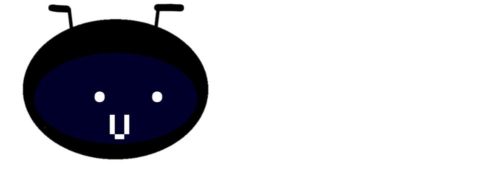

Una aplicación web Open Source praa aprender a hacer juegos 3d.

# dependencias

* Internet (xdddd)
* Three js 140
* Blockly

# cosas a tomar en cuenta:

* El editor esta en español.
* El proyecto esta en desarrollo.
* El proyecto es puramente para enseñar y yo como dev aprender varias cosas.
